Entity Relationship Diagram — Architect Portfolio Platform
System: Architect Portfolio Platform
Document: Entity Relationship Diagram (ERD)
Status: Draft
Date: 2026-08-31
Database: Relational Database
ORM: Entity Framework Core

# 1. Purpose
This document defines the relational data model for the Architect Portfolio Platform.
The ERD represents the persistence model derived from:
* Domain Model
* DDD Tactical Model
* Application Use Cases
* API Contract Design
* Persistence Model

The ERD describes:
* Database entities/tables
* Primary keys
* Foreign keys
* Relationships
* Cardinality
* Unique constraints
* Important indexes
* Logical ownership

The ERD is intentionally separate from the Domain Model.
> **Note:** The database schema supports the Domain Model; it does not define it.

---

# 2. Database Context
The platform uses a **single relational database** as part of the Modular Monolith architecture.

```
                         Architect Portfolio Platform
                                     │
                              Modular Monolith
                                     │
                              ┌──────▼──────┐
                              │  Relational │
                              │   Database  │
                              └──────┬──────┘
                                     │
                    ┌────────────────┴────────────────┐
                    │                                 │
             Portfolio Context                Administration Context
                    │                                 │
          ┌─────────┴─────────┐                ┌──────┴──────┐
          │                   │                │             │
       Content             Identity          Access        Audit
```

---

# 3. Design Principles
The persistence model follows these principles:
1. Relational integrity is enforced using primary and foreign keys.
2. Critical uniqueness rules are enforced using database constraints.
3. Aggregate roots are the primary repository boundaries.
4. Internal aggregate entities are not exposed as independent domain repositories.
5. Domain entities are mapped to persistence structures through EF Core.
6. Domain objects remain independent of EF Core.
7. Public API DTOs are independent of database entities.
8. File contents are stored outside the relational database.
9. Audit records are retained independently from mutable business data.
10. Indexes are driven by actual query patterns.
11. Concurrency is handled using optimistic concurrency.
12. Database transactions protect application command boundaries.

---

# 4. Complete ERD
The following Mermaid ERD represents the initial logical database model.

```mermaid
erDiagram

    ARCHITECT_PROFILES {
        uuid id PK
        varchar name
        varchar headline
        text bio
        varchar email
        varchar location
        varchar slug UK
        datetime created_at
        datetime updated_at
        binary row_version
    }

    EXPERIENCES {
        uuid id PK
        uuid profile_id FK
        varchar company
        varchar position
        text description
        date start_date
        date end_date
        boolean is_current
        int display_order
        datetime created_at
        datetime updated_at
    }

    SKILLS {
        uuid id PK
        uuid profile_id FK
        varchar name
        varchar proficiency_level
        int display_order
        datetime created_at
        datetime updated_at
    }

    PROJECTS {
        uuid id PK
        varchar title
        varchar slug UK
        varchar summary
        text description
        date start_date
        date end_date
        boolean is_featured
        varchar status
        datetime published_at
        datetime created_at
        datetime updated_at
        binary row_version
    }

    PROJECT_IMAGES {
        uuid id PK
        uuid project_id FK
        varchar storage_key
        varchar url
        varchar caption
        int display_order
        boolean is_hero
        datetime created_at
    }

    ARTICLES {
        uuid id PK
        varchar title
        varchar slug UK
        varchar summary
        text content
        varchar status
        int reading_time_minutes
        datetime published_at
        datetime created_at
        datetime updated_at
        binary row_version
    }

    ARTICLE_CATEGORIES {
        uuid id PK
        varchar name UK
        varchar slug UK
    }

    ARTICLE_CATEGORY_MAPPINGS {
        uuid article_id PK, FK
        uuid category_id PK, FK
    }

    TAGS {
        uuid id PK
        varchar name UK
        varchar slug UK
    }

    ARTICLE_TAGS {
        uuid article_id PK, FK
        uuid tag_id PK, FK
    }

    SOCIAL_PROFILES {
        uuid id PK
        uuid profile_id FK
        varchar platform
        varchar url
        int display_order
        boolean is_visible
        datetime created_at
        datetime updated_at
    }

    DOCUMENTS {
        uuid id PK
        varchar type
        varchar file_name
        varchar storage_key
        varchar content_type
        bigint file_size
        boolean is_active
        datetime uploaded_at
    }

    USERS {
        uuid id PK
        varchar email UK
        varchar password_hash
        boolean is_active
        datetime created_at
        datetime updated_at
        datetime last_login_at
        binary row_version
    }

    ROLES {
        uuid id PK
        varchar name UK
        boolean is_system_role
        datetime created_at
        datetime updated_at
    }

    USER_ROLES {
        uuid user_id PK, FK
        uuid role_id PK, FK
        datetime assigned_at
    }

    PERMISSIONS {
        uuid id PK
        varchar key UK
        varchar description
    }

    ROLE_PERMISSIONS {
        uuid role_id PK, FK
        uuid permission_id PK, FK
    }

    AUDIT_LOGS {
        uuid id PK
        uuid user_id FK
        varchar action
        varchar entity_type
        uuid entity_id
        datetime timestamp
        json metadata
    }


    ARCHITECT_PROFILES ||--o{ EXPERIENCES : contains
    ARCHITECT_PROFILES ||--o{ SKILLS : contains
    ARCHITECT_PROFILES ||--o{ SOCIAL_PROFILES : contains

    PROJECTS ||--o{ PROJECT_IMAGES : contains

    ARTICLES ||--o{ ARTICLE_CATEGORY_MAPPINGS : classified_by
    ARTICLE_CATEGORIES ||--o{ ARTICLE_CATEGORY_MAPPINGS : contains

    ARTICLES ||--o{ ARTICLE_TAGS : tagged_with
    TAGS ||--o{ ARTICLE_TAGS : contains

    USERS ||--o{ USER_ROLES : assigned
    ROLES ||--o{ USER_ROLES : contains

    ROLES ||--o{ ROLE_PERMISSIONS : grants
    PERMISSIONS ||--o{ ROLE_PERMISSIONS : assigned

    USERS ||--o{ AUDIT_LOGS : creates
```



---

# 5. Portfolio Context
The Portfolio bounded context contains the professional portfolio information.

```
Portfolio
│
├── Architect Profile
├── Experience
├── Skills
├── Projects
├── Articles
├── Social Profiles
└── Documents
```

---

# 6. Architect Profile
**Table:** `ARCHITECT_PROFILES`

The profile represents the central professional identity.

### Relationships
```
ArchitectProfile
    │
    ├── Experiences
    ├── Skills
    └── SocialProfiles
```

**Relationship cardinality:**
* `ArchitectProfile 1 ──── * Experience`
* `ArchitectProfile 1 ──── * Skill`
* `ArchitectProfile 1 ──── * SocialProfile`

### Constraints
* `slug` → `UNIQUE`

The initial system assumes one primary architect profile, although the schema does not technically prevent multiple records.

---

# 7. Experience
**Table:** `EXPERIENCES`

Each experience record belongs to the architect profile.

```
ArchitectProfile
       │
       │ 1
       ▼
   Experience
       │
       │ *
```

**Foreign key:**
* `EXPERIENCES.profile_id` → `ARCHITECT_PROFILES.id`

### Business Data
* Company
* Position
* Description
* Start date
* End date
* Current status
* Display order

### Temporal Constraints
The application/domain layer must enforce:
* `start_date <= end_date` (when an end date exists).

---

# 8. Skills
**Table:** `SKILLS`

Skills belong to the portfolio profile.

```
ArchitectProfile
       │
       ▼
     Skills
```

The `display_order` field supports presentation ordering without relying on database insertion order.

---

# 9. Projects
**Table:** `PROJECTS`

Projects are independent aggregate roots.

```
Project
├── Metadata
├── Duration
├── Status
└── ProjectImages
```

The database represents the project aggregate using:
* `PROJECTS`
* `PROJECT_IMAGES`

### Project Status
The initial persistence model supports:
* Draft
* Published
* Archived

### Important Constraints & Indexes
* `slug` → `UNIQUE`
* **Indexes:** `status`, `is_featured`, `published_at`

These support common public and administrative queries.

---

# 10. Project Images
**Table:** `PROJECT_IMAGES`

Each image belongs to exactly one project.

```
Project
   │
   │ 1
   ▼
ProjectImage
   │
   │ *
```

**Foreign key:**
* `PROJECT_IMAGES.project_id` → `PROJECTS.id`

The database stores image metadata and storage references. The actual binary file is handled by the Infrastructure file-storage implementation.

---

# 11. Articles
**Table:** `ARTICLES`

Articles represent technical publications and architectural case studies.
Each article has:
* Title
* Slug
* Summary
* Content
* Status
* Reading time
* Publication date

### Status
* Draft
* Published
* Archived

### Constraints & Indexes
* `slug` → `UNIQUE`
* **Indexes:** `status`, `published_at`

---

# 12. Article Categories
**Table:** `ARTICLE_CATEGORIES`

Categories classify articles. An article may belong to multiple categories.

Relationship: `Article * ──── * Category`

This many-to-many relationship is represented through `ARTICLE_CATEGORY_MAPPINGS`.

**Composite primary key:** `(article_id, category_id)` to prevent duplicate category assignments.

---

# 13. Article Tags
Tags provide more flexible classification than categories.

Relationship: `Article * ──── * Tag`

The relationship is represented by `ARTICLE_TAGS`.

**Composite primary key:** `(article_id, tag_id)` to prevent assigning the same tag to an article more than once.

---

# 14. Social Profiles
**Table:** `SOCIAL_PROFILES`

Social profiles belong to the architect profile. Examples:
* LinkedIn
* GitHub
* Medium
* Behance
* X

The `platform` field identifies the external platform while `url` contains the target address.
The domain/application layer is responsible for validating supported platforms and URL rules.

---

# 15. Documents
**Table:** `DOCUMENTS`

Documents represent uploaded files such as the CV.
The relational database stores metadata:
* `FileName`
* `StorageKey`
* `ContentType`
* `FileSize`
* `UploadedAt`

The actual file is stored externally:

```
                Database
                   │
                   ▼
              DOCUMENTS
                   │
              StorageKey
                   │
                   ▼
          Object/File Storage
                   │
                   ▼
             Actual File
```

This prevents large binary files from unnecessarily increasing database size.

---

# 16. Administration Context
The Administration bounded context manages:
* Users
* Roles
* Permissions
* Audit Logs

Conceptually:
```
Administration
│
├── Users
│
├── Roles
│
├── Permissions
│
└── Audit Logs
```

---

# 17. Users
**Table:** `USERS`

A user represents an administrative identity. Users are not the same thing as the public `ArchitectProfile`.

```
User ≠ ArchitectProfile
```

* **User represents:** Who can access the administration system?
* **Profile represents:** Whose professional portfolio is being presented?

This distinction keeps authentication concerns separate from portfolio-domain concerns.

---

# 18. Roles
**Table:** `ROLES`

Roles group permissions. Examples:
* SuperAdmin
* Editor
* Viewer

A role can be assigned to multiple users. A user can have multiple roles.

Relationship: `User * ──── * Role` is represented through `USER_ROLES`.

---

# 19. User Roles
**Table:** `USER_ROLES`

**Composite primary key:** `(user_id, role_id)`

```
Users
  │
  ├──── Role
  ├──── Role
  └──── Role
```

The domain/application layer enforces the rule that an active user must maintain the required role assignment.

---

# 20. Permissions
**Table:** `PERMISSIONS`

Permissions represent individual system capabilities. Examples:
* `profile:read`, `profile:write`
* `projects:read`, `projects:write`, `projects:publish`, `projects:delete`
* `articles:read`, `articles:write`, `articles:publish`
* `users:read`, `users:write`

Permission keys are unique: `UNIQUE(key)`

---

# 21. Role Permissions
**Table:** `ROLE_PERMISSIONS`

Roles and permissions have a many-to-many relationship: `Role * ──── * Permission`

The join table contains:
* `role_id`
* `permission_id`

**Composite primary key:** `(role_id, permission_id)`

---

# 22. Audit Logs
**Table:** `AUDIT_LOGS`

Audit logs record security-sensitive or administrative operations. Examples:
* `ProjectPublished`
* `ArticlePublished`
* `UserRoleAssigned`
* `UserDeactivated`
* `ProfileUpdated`

```
User
 │
 └──── AuditLogs
```

An audit log should remain available even if the related business record is later removed or archived. Therefore, audit-log deletion should not cascade from the business entity.

---

# 23. Aggregate Boundaries vs Database Relationships
The ERD does not mean every foreign-key relationship represents an aggregate boundary.

For example:
```
Project
   │
   └── ProjectImages
```
can represent one aggregate.

Whereas:
```
Article
   │
   └── Category
```
represents a relationship between independently managed concepts.

The Domain Model remains authoritative for aggregate boundaries.

---

# 24. Referential Integrity
Foreign keys enforce valid relationships. Examples:
* `EXPERIENCES.profile_id` → `ARCHITECT_PROFILES.id`
* `PROJECT_IMAGES.project_id` → `PROJECTS.id`
* `USER_ROLES.user_id` → `USERS.id`
* `USER_ROLES.role_id` → `ROLES.id`
* `ROLE_PERMISSIONS.role_id` → `ROLES.id`
* `ROLE_PERMISSIONS.permission_id` → `PERMISSIONS.id`

---

# 25. Unique Constraints
The database should enforce the following unique constraints rather than relying exclusively on application validation:

| Table | Column |
| :--- | :--- |
| `ArchitectProfiles` | `Slug` |
| `Projects` | `Slug` |
| `Articles` | `Slug` |
| `Users` | `Email` |
| `Roles` | `Name` |
| `Permissions` | `Key` |
| `ArticleCategories` | `Name`, `Slug` |
| `Tags` | `Name`, `Slug` |

---

# 26. Index Strategy
Initial indexes:
* **ArchitectProfiles:** `UNIQUE(slug)`
* **Projects:** `UNIQUE(slug)`, `INDEX(status)`, `INDEX(is_featured)`, `INDEX(published_at)`
* **Articles:** `UNIQUE(slug)`, `INDEX(status)`, `INDEX(published_at)`
* **Users:** `UNIQUE(email)`
* **Roles:** `UNIQUE(name)`
* **Permissions:** `UNIQUE(key)`
* **Categories:** `UNIQUE(name)`, `UNIQUE(slug)`
* **Tags:** `UNIQUE(name)`, `UNIQUE(slug)`

Additional indexes should be introduced based on observed query patterns.

---

# 27. Concurrency
Optimistic concurrency is required for important mutable aggregates. The initial model uses `row_version` on:
* `ArchitectProfiles`
* `Projects`
* `Articles`
* `Users`

**Example:**
```
Admin A
   │
   ├── Reads Project version 5
   │
   ▼
Project version 5

Admin B
   │
   ├── Reads Project version 5
   │
   ▼
Project version 5
```

If Admin A updates first: `Project version 5 → Project version 6`.
Admin B's update using version 5 should fail with a concurrency conflict.
The API translates this into: `409 Conflict`.

---

# 28. Delete Strategy
Deletion behavior differs by entity:
* **Projects:** Prefer logical deletion/archive behavior (`Draft`, `Published`, `Archived`).
* **Articles:** Prefer logical deletion/archive behavior (`Draft`, `Published`, `Archived`).
* **Users:** Deactivate instead of deleting whenever possible (`IsActive = false`).
* **Roles:** System roles cannot be deleted.
* **Permissions:** System permissions should be treated as controlled configuration.
* **Audit Logs:** Audit records should not be deleted as part of normal business operations.

---

# 29. Transaction Boundaries
Application commands should normally execute inside a transaction.

**Example:**
```
PublishProjectCommand
        │
        ▼
Project Aggregate
        │
        ├── Validate
        │
        ├── Change Status
        │
        └── Raise ProjectPublished
                │
                ▼
          Database Transaction
```
The transaction should protect the consistency of the aggregate state.

---

# 30. Database vs Domain Responsibilities
* **Database Responsibilities:** Primary keys, Foreign keys, Unique constraints, Indexes, Referential integrity, Concurrency tokens.
* **Domain Responsibilities:** Business rules, State transitions, Aggregate invariants, Value-object validation, Domain events.
* **Application Layer Responsibilities:** Use-case orchestration, Authorization, Transactions, Cross-aggregate coordination.
* **Infrastructure Responsibilities:** EF Core, Database access, Repository implementation, Migrations, File storage, External services.

---

# 31. Persistence Flow
The complete architecture is:

```
┌──────────────────────┐
│ Portfolio Web        │
└──────────┬───────────┘
           │
┌──────────▼───────────┐
│ Admin Dashboard      │
└──────────┬───────────┘
           │
┌──────────▼───────────┐
│ iOS Application      │
└──────────┬───────────┘
           │
           ▼
┌──────────────────────┐
│ REST API             │
└──────────┬───────────┘
           │
           ▼
┌──────────────────────┐
│ Application Layer    │
│ Commands / Queries   │
└──────────┬───────────┘
           │
           ▼
┌──────────────────────┐
│ Domain Layer         │
│ Aggregates / Rules   │
└──────────┬───────────┘
           │
           ▼
┌──────────────────────┐
│ Repository Interface │
└──────────┬───────────┘
           │
           ▼
┌──────────────────────┐
│ Infrastructure       │
│ EF Core              │
└──────────┬───────────┘
           │
           ▼
┌──────────────────────┐
│ Relational Database  │
└──────────────────────┘
```

---

# 32. Schema Ownership
Logical ownership follows the bounded contexts:

```
Portfolio Context
│
├── ArchitectProfiles
├── Experiences
├── Skills
├── Projects
├── ProjectImages
├── Articles
├── ArticleCategories
├── ArticleCategoryMappings
├── Tags
├── ArticleTags
├── SocialProfiles
└── Documents

Administration Context
│
├── Users
├── Roles
├── UserRoles
├── Permissions
├── RolePermissions
└── AuditLogs
```

Even though these tables exist in one physical database, their logical ownership remains separated.

---

# 33. Future Evolution
The initial architecture deliberately uses one relational database. If future requirements introduce significantly different scaling or operational characteristics, individual modules may be separated.

```
Current

                Modular Monolith
                       │
                ┌──────▼──────┐
                │ One Database│
                └─────────────┘


Possible Future

        Portfolio Service       Administration Service
               │                         │
               ▼                         ▼
        Portfolio DB               Identity DB
```

This should only happen if justified by architecture drivers. The current system does not require distributed databases.

---

# 34. ERD Validation Checklist
Before implementation, verify:
- [x] All major domain concepts have persistence representation.
- [x] Aggregate relationships are represented.
- [x] Primary keys are defined.
- [x] Foreign keys are defined.
- [x] Many-to-many relationships use join tables.
- [x] Critical uniqueness constraints are identified.
- [x] Query-oriented indexes are identified.
- [x] Concurrency strategy is defined.
- [x] Audit requirements are represented.
- [x] File storage is separated from relational persistence.
- [x] Database responsibilities are separated from domain responsibilities.
- [x] Portfolio and Administration logical ownership is documented.

---

# 35. Architectural Decision
The Architect Portfolio Platform will initially use:
* **Relational Database**
* **Entity Framework Core**
* **Single Database**
* **Logical Module Ownership**
* **Aggregate-Oriented Repositories**
* **Optimistic Concurrency**

The database schema is an implementation detail of the Infrastructure layer and must not leak into the Domain layer.
The ERD therefore serves as the persistence blueprint for the next architectural phase: **Infrastructure Design**.
